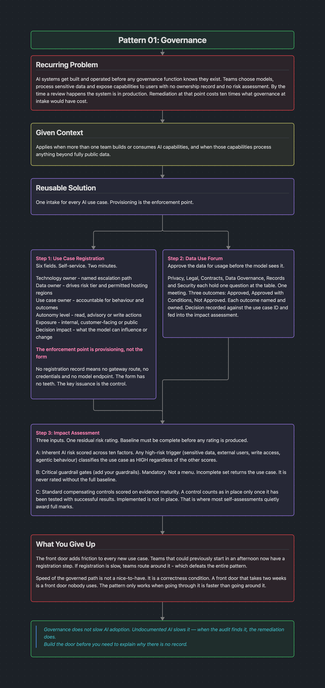
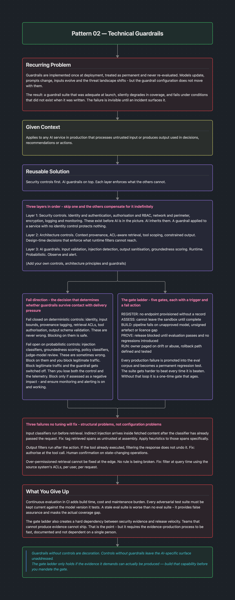
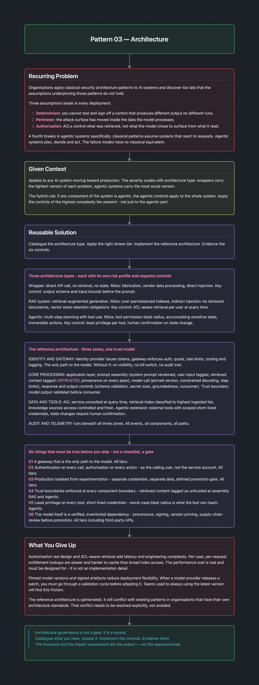
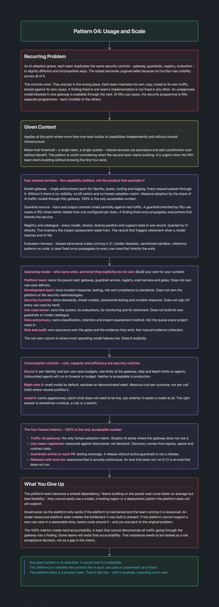

# OdysseyAI Patterns

AI security design patterns covering governance, guardrails, architecture and scale.

Editable sources are in [`canvas/`](canvas/). Open them in Obsidian.

## 01 · Governance

## 02 · Technical Guardrails

## 03 · Architecture

## 04 · Usage & Scale

---

## Usage & Attribution

You're welcome to use, share and adapt these patterns in your own work, whether that's presentations, internal guidance, training material or architecture reviews.

**Attribution is required.** Please credit:

> Ryan Winstanley, *OdysseyAI Patterns*, https://github.com/winsyr/OdysseyAI_Patterns

**Please use sensibly:**
- Don't present this work as your own
- If you've changed it, say so
- Don't use it to imply my endorsement of your product, service or organisation
- These are general design patterns, not a substitute for a proper risk assessment in your own environment

Content is licensed under [CC BY 4.0](https://creativecommons.org/licenses/by/4.0/). See [`LICENSE`](LICENSE).

These patterns are my own and do not represent the views of any current or former employer.
